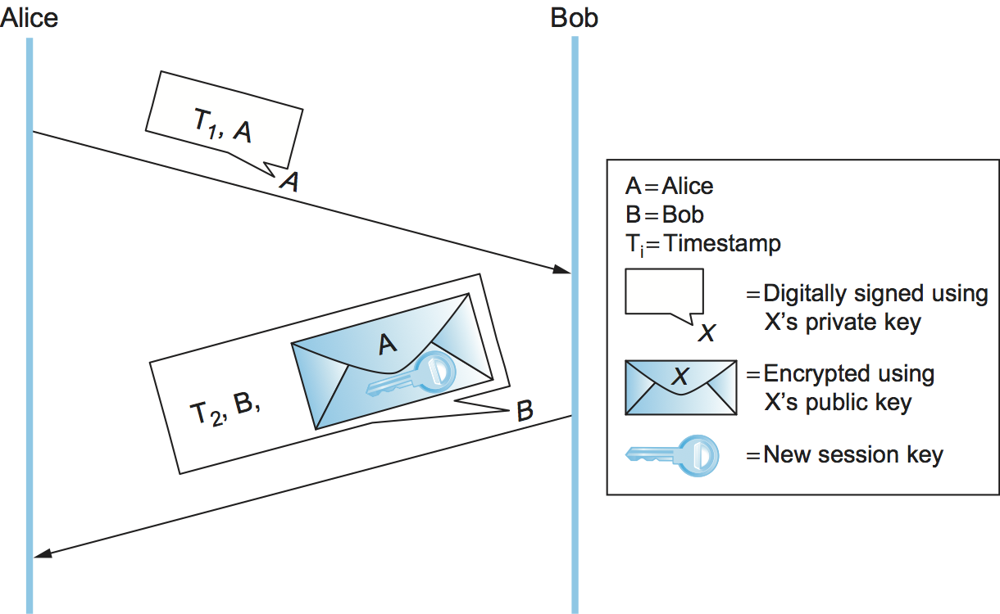
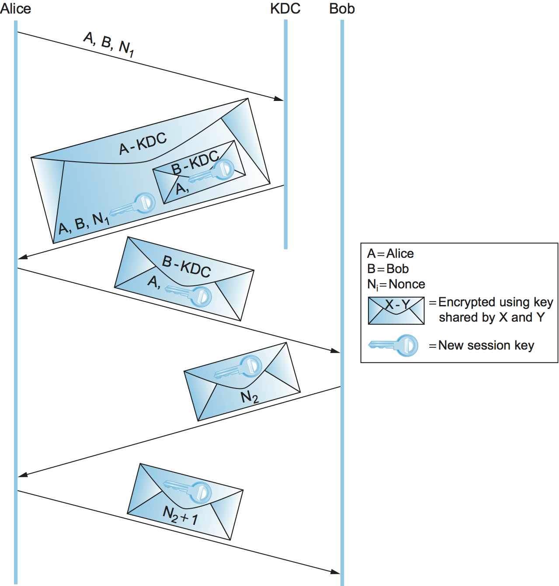

# {{ page.title }}

So far we described how to encrypt messages, build authenticators,
predistribute the necessary keys. It might seem as if all we have to
do to make a protocol secure is append an authenticator to every
message and, if we want confidentiality, encrypt the message.

There are two main reasons why it's not that simple. First, there is the
problem of a *replay attack*: an adversary retransmitting a copy of a
message that was previously sent. If the message was an order you had
placed on a website, for example, then the replayed message would appear
to the website as though you had ordered more of the same. Even though
it wasn't the original incarnation of the message, its authenticator
would still be valid; after all, the message was created by you, and it
wasn't modified. Clearly, we need the solution that ensures
*originality*.

In a variation of this attack called a
*suppress-replay attack*, an adversary might merely delay your message
(by intercepting and later replaying it), so that it is received at a
time when it is no longer appropriate. For example, an adversary could
delay your order to buy stock from an auspicious time to a time when
you would not have wanted to buy. Although this message would in a
sense be the original, it wouldn't be timely. So we also need to ensure
*timeliness*. Originality and timeliness may be considered aspects of
integrity. Ensuring them will in most cases require a nontrivial,
back-and-forth protocol.

The second problem we have not yet solved is how to establish a session
key. A session key is a symmetric-key cipher key generated on the fly
and used for just one session. This too involves a nontrivial protocol.

What these two issues have in common is authentication. If a message is
not original and timely, then from a practical standpoint we want to
consider it as not being authentic, not being from whom it claims to be.
And, obviously, when you are arranging to share a new session key with
someone, you want to know you are sharing it with the right person.
Usually, authentication protocols establish a session key at the same
time, so that at the end of the protocol Alice and Bob have
authenticated each other and they have a new symmetric key to use.
Without a new session key, the protocol would just authenticate Alice
and Bob at one point in time; a session key allows them to efficiently
authenticate subsequent messages. Generally, session key establishment
protocols perform authentication (a notable exception is
Diffie-Hellman, as described below, so the terms *authentication
protocol* and *session key establishment protocol* are almost
synonymous.

There is a core set of techniques used to ensure originality and
timeliness in authentication protocols. We describe those techniques
before moving on to particular protocols.

## Originality and Timeliness Techniques

We have seen that authenticators alone do not enable us to detect
messages that are not original or timely. One approach is to include a
timestamp in the message. Obviously the timestamp itself must be
tamperproof, so it must be covered by the authenticator. The primary
drawback to timestamps is that they require distributed clock
synchronization. Since our system would then depend on synchronization,
the clock synchronization itself would need to be defended against
security threats, in addition to the usual challenges of clock
synchronization. Another issue is that distributed clocks are
synchronized to only a certain degree—a certain margin of error. Thus,
the timing integrity provided by timestamps is only as good as the
degree of synchronization.

Another approach is to include a *nonce*—a random number used only
once—in the message. Participants can then detect replay attacks by
checking whether a nonce has been used previously. Unfortunately, this
requires keeping track of past nonces, of which a great many could
accumulate. One solution is to combine the use of timestamps and nonces,
so that nonces are required to be unique only within a certain span of
time. That makes ensuring uniqueness of nonces manageable while
requiring only loose synchronization of clocks.

Another solution to the shortcomings of timestamps and nonces is to use
one or both of them in a *challenge-response* protocol. Suppose we use
a timestamp. In a challenge-response protocol, Alice sends Bob a
timestamp, challenging Bob to encrypt it in a response message (if they
share a symmetric key) or digitally sign it in a response message (if
Bob has a public key, as in [Figure 1](#challenge-response)). The
encrypted timestamp is like an authenticator that additionally proves
timeliness. Alice can easily check the timeliness of the timestamp in a
response from Bob since that timestamp comes from Alice's own clock—no
distributed clock synchronization needed. Suppose instead that the
protocol uses nonces. Then Alice need only keep track of those nonces
for which responses are currently outstanding and haven't been
outstanding too long; any purported response with an unrecognized nonce
must be bogus.

<figure>
	
	
	<figcaption>A challenge-response protocol.</figcaption>
</figure>

The beauty of challenge-response, which might otherwise seem
excessively complex, is that it combines timeliness and authentication;
after all, only Bob (and possibly Alice, if it's a symmetric-key cipher)
knows the key necessary to encrypt the never before seen timestamp or
nonce. Timestamps or nonces are used in most of the authentication
protocols that follow.

## Public-Key Authentication Protocols

In the following discussion, we assume that Alice and Bob's public keys
have been predistributed to each other via some means such as a PKI. We
mean this to include the case where Alice includes her certificate in
her first message to Bob, and the case where Bob searches for a
certificate about Alice when he receives her first message.

<figure>
	
	
	<figcaption>A public-key authentication protocol that depends on
	synchronization.</figcaption>
</figure>

This first protocol ([Figure 2](#pKAuthSync)) relies on Alice and Bob's
clocks being synchronized. Alice sends Bob a message with a timestamp
and her identity in plaintext plus her digital signature. Bob uses the
digital signature to authenticate the message and the timestamp to
verify its freshness. Bob sends back a message with a timestamp and his
identity in plaintext, as well as a new session key encrypted (for
confidentiality) using Alice's public key, all digitally signed. Alice
can verify the authenticity and freshness of the message, so she knows
she can trust the new session key. To deal with imperfect clock
synchronization, the timestamps could be augmented with nonces.

The second protocol ([Figure 3](#pKAuthNoSync)) is similar but does not
rely on clock synchronization. In this protocol, Alice again sends Bob a
digitally signed message with a timestamp and her identity. Because
their clocks aren't synchronized, Bob cannot be sure that the message is
fresh. Bob sends back a digitally signed message with Alice's original
timestamp, his own new timestamp, and his identity. Alice can verify the
freshness of Bob's reply by comparing her current time against the
timestamp that originated with her. She then sends Bob a digitally
signed message with his original timestamp and a new session key
encrypted using Bob's public key. Bob can verify the freshness of the
message because the timestamp came from his clock, so he knows he can
trust the new session key. The timestamps essentially serve as
convenient nonces, and indeed this protocol could use nonces instead.

<figure>
	
	
	<figcaption>A public-key authentication protocol that does not
	depend on synchronization. Alice checks her own timestamp against
	her own clock, and likewise for Bob.</figcaption>
</figure>

## Symmetric-Key Authentication Protocols

Only in fairly small systems is it practical to predistribute symmetric
keys to every pair of entities. We focus here on larger systems, where
each entity would have its own *master key* shared only with a Key
Distribution Center (KDC). In this case, symmetric-key-based
authentication protocols involve three parties: Alice, Bob, and a KDC.
The end product of the authentication protocol is a session key shared
between Alice and Bob that they will use to communicate directly,
without involving the KDC.

<figure>
	
	
	<figcaption>The Needham-Schroeder authentication protocol.</figcaption>
</figure>

The Needham-Schroeder authentication protocol is illustrated in
[Figure 4](#needhamSchroeder). Note that the KDC doesn't actually
authenticate Alice's initial message and doesn't communicate with Bob at
all. Instead, the KDC uses its knowledge of Alice's and Bob's master
keys to construct a reply that would be useless to anyone other than
Alice (because only Alice can decrypt it) and contains the necessary
ingredients for Alice and Bob to perform the rest of the authentication
protocol themselves.

The nonce in the first two messages is to assure Alice that the KDC's
reply is fresh. The second and third messages include the new session
key and Alice's identifier, encrypted together using Bob's master key.
It is a sort of symmetric-key version of a public-key certificate; it is
in effect a signed statement by the KDC (because the KDC is the only
entity besides Bob who knows Bob's master key) that the enclosed session
key is owned by Alice and Bob. Although the nonce in the last two
messages is intended to assure Bob that the third message was fresh,
there is a flaw in this reasoning.

### Kerberos

Kerberos is an authentication system based on the Needham-Schroeder
protocol and specialized for client/server environments. Originally
developed at MIT, it has been standardized by the IETF and is available
as both open source and commercial products. We will focus here on some
of Kerberos's interesting innovations.

Kerberos clients are generally human users, and users authenticate
themselves using passwords. Alice's master key, shared with the KDC, is
derived from her password—if you know the password, you can compute
the key. Kerberos assumes anyone can physically access any client
machine; therefore, it is important to minimize the exposure of Alice's
password or master key not just in the network but also on any machine
where she logs in. Kerberos takes advantage of Needham-Schroeder to
accomplish this. In Needham-Schroeder, the only time Alice needs to use
her password is when decrypting the reply from the KDC. Kerberos
client-side software waits until the KDC's reply arrives, prompts Alice
to enter her password, computes the master key and decrypts the KDC's
reply, and then erases all information about the password and master key
to minimize its exposure. Also note that the only sign a user sees of
Kerberos is when the user is prompted for a password.

In Needham-Schroeder, the KDC's reply to Alice plays two roles: It
gives her the means to prove her identity (only Alice can decrypt the
reply), and it gives her a sort of symmetric-key certificate or "ticket"
to present to Bob—the session key and Alice's identifier, encrypted
with Bob's master key. In Kerberos, those two functions—and the KDC
itself, in effect—are split up ([Figure 5](#kerberos)). A trusted
server called an Authentication Server (AS) plays the first KDC role of
providing Alice with something she can use to prove her identity—not
to Bob this time, but to a second trusted server called a Ticket
Granting Server (TGS). The TGS plays the second KDC role, replying to
Alice with a ticket she can present to Bob. The attraction of this
scheme is that if Alice needs to communicate with several servers, not
just Bob, then she can get tickets for each of them from the TGS without
going back to the AS.

<figure>
	
	
	<figcaption>Kerberos authentication.</figcaption>
</figure>

In the client/server application domain for which Kerberos is intended,
it is reasonable to assume a degree of clock synchronization. This
allows Kerberos to use timestamps and lifespans instead of
Needham-Shroeder's nonces, and thereby eliminate the Needham-Schroeder
security weakness explored in Exercise 4. Kerberos supports a choice of
cryptographic algorithms including the hashes SHA-1 and MD5 and the
symmetric-key ciphers AES, 3DES, and DES.

## Diffie-Hellman Key Agreement

The Diffie-Hellman key agreement protocol establishes a session key
without using any predistributed keys. The messages exchanged between
Alice and Bob can be read by anyone able to eavesdrop, and yet the
eavesdropper won't know the session key that Alice and Bob end up with.
On the other hand, Diffie-Hellman doesn't authenticate the
participants. Since it is rarely useful to communicate securely without
being sure whom you're communicating with, Diffie-Hellman is usually
augmented in some way to provide authentication. One of the main uses of
Diffie-Hellman is in the Internet Key Exchange (IKE) protocol, a
central part of the IP Security (IPsec) architecture.

The Diffie-Hellman protocol has two parameters, $$p$$ and $$g$$, both of
which are public and may be used by all the users in a particular
system. Parameter $$p$$ must be a prime number. The integers
$$\bmod p$$ (short for modulo $$p$$) are $$0$$ through $$p-1$$, since
$$x \bmod p$$ is
the remainder after $$x$$ is divided by $$p$$, and form what mathematicians
call a *group* under multiplication. Parameter $$g$$ (usually called a
generator) must be a *primitive root* of $$p$$: For every number $$n$$ from
1 through $$p-1$$ there must be some value $$k$$ such that
$$n = g^k \bmod p$$. For example, if $$p$$ were the prime number 5 (a real
system would use a much larger number), then we might choose 2 to be
the generator $$g$$ since:

$$
1 = 2^0 \bmod p
$$

$$
2 = 2^1 \bmod p
$$

$$
3 = 2^3 \bmod p
$$

$$
4 = 2^2 \bmod p
$$

Suppose Alice and Bob want to agree on a shared symmetric key. Alice and
Bob, and everyone else, already know the values of $$p$$ and $$g$$. Alice
generates a random private value $$a$$ and Bob generates a random private
value $$b$$. Both $$a$$ and $$b$$ are drawn from the set of integers
$$\{1,$$ ..., $$p-1\}$$. Alice and Bob derive their corresponding public
values—the values they will send to each other unencrypted—as
follows. Alice's public value is

$$
g^a \bmod p
$$

and Bob's public value is

$$
g^b \bmod p
$$

They then exchange their public
values. Finally, Alice computes

$$
g^{ab} \bmod p = (g^b \bmod p)^a \bmod p
$$

and Bob
computes

$$
g^{ba} \bmod p = (g^a \bmod p)^b \bmod p.
$$

Alice
and Bob now have $$g^{ab} \bmod p$$ (which is equal to
$$g^{ba} \bmod p$$) as their shared symmetric key.

Any eavesdropper would know $$p, g$$, and the two public values
$$g^a \bmod p$$ and $$g^b \bmod p$$. If only the eavesdropper could
determine $$a$$
or $$b$$, she could easily compute the resulting key. Determining $$a$$ or
$$b$$ from that information is, however, computationally infeasible for
suitably large $$p,a$$, and $$b$$; it is known as the *discrete logarithm
problem*.

On the other hand, there is the problem of Diffie-Hellman's lack of
authentication. One attack that can take advantage of this is the
*man-in-the-middle attack*. Suppose Mallory is an adversary with the
ability to intercept messages. Mallory already knows $$p$$ and $$g$$ since
they are public, and she generates random private values $$c$$ and $$d$$ to
use with Alice and Bob, respectively. When Alice and Bob send their
public values to each other, Mallory intercepts them and sends her own
public values, as in [Figure 6](#manInTheMiddle). The result is that
Alice and Bob each end up unknowingly sharing a key with Mallory instead
of each other.

<figure>
	
	
	<figcaption>A man-in-the-middle attackn.</figcaption>
</figure>

A variant of Diffie-Hellman sometimes called *fixed Diffie-Hellman*
supports authentication of one or both participants. It relies on
certificates that are similar to public key certificates but instead
certify the Diffie-Hellman public parameters of an entity. For example,
such a certificate would state that Alice's Diffie-Hellman parameters
are $$p,g$$, and $$g^a \bmod p$$ (note that the value of $$a$$ would still be
known only to Alice). Such a certificate would assure Bob that the other
participant in Diffie-Hellman is Alice—or else the other participant
won't be able to compute the secret key, because she won't know $$a$$. If
both participants have certificates for their Diffie-Hellman
parameters, they can authenticate each other. If just one has a
certificate, then just that one can be authenticated. This is useful in
some situations; for example, when one participant is a web server and
the other is an arbitrary client, the client can authenticate the web
server and establish a session key for confidentiality before sending a
credit card number to the web server.
